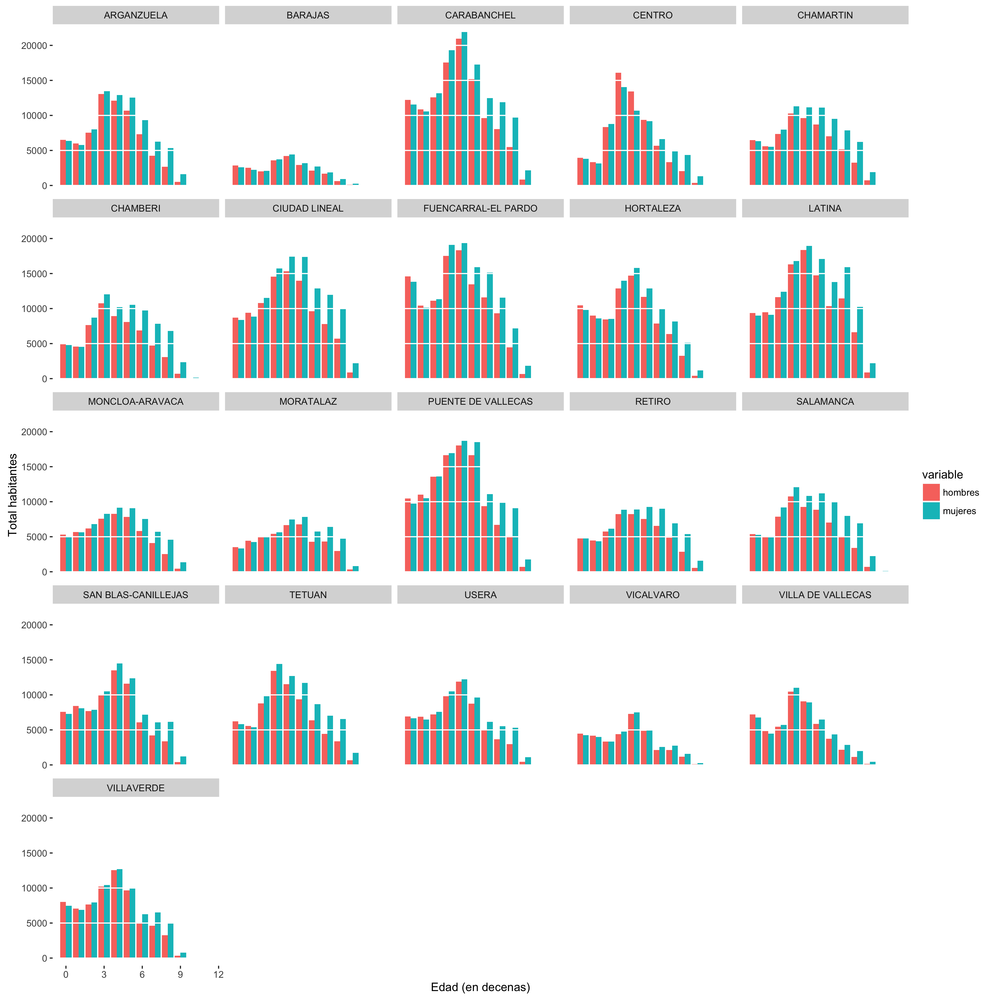
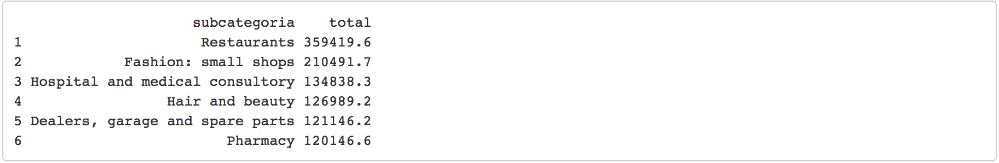
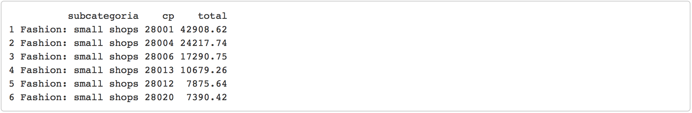
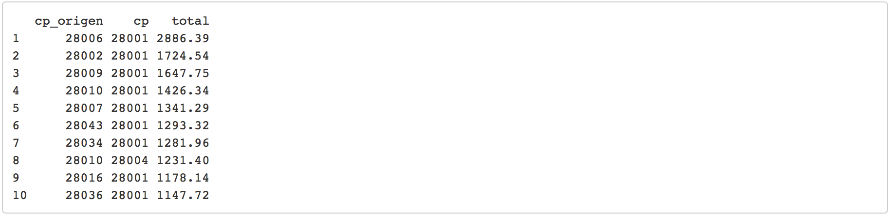
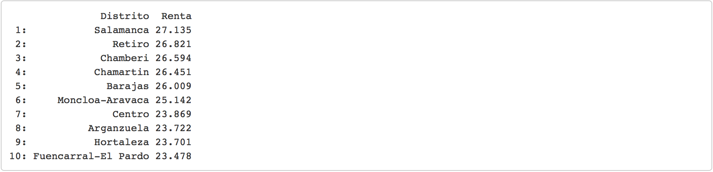
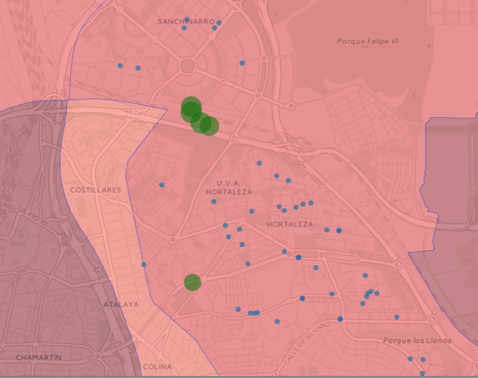

#La historia de Juan Sin Miedo

Juan sin Miedo es un joven recién licenciado en busca de empleo. Sabe que las cosas no están fáciles para los jóvenes así que, seducido por las historias de hombres y mujeres que emprenden su propio negocio, sin jefes, sin horarios fijos y ganando mucho dinero, está decidido a probar suerte y montar su propia empresa.

Juan es un fanático de los coches y su ilusión sería emprender algo relacionado con ese tema. Sin embargo, en sus dos años como becario en una gestoría ha aprendido que la mayoría de las empresas no superan los cinco primeros años de vida. Lo que a uno le gusta no siempre es lo que la sociedad necesita.

Por este motivo está decidido a buscar información para intentar encontrar negocios viables. Ha oido hablar de algo llamado **ciencia de datos** y Juan, al que le gusta la ciencia, decide usar un enfoque científico en su búsqueda . Así que, con determinación, empieza a navegar por internet en busca de datos que le srivan de ayuda.

Lo primero que hace es descargarse una tabla con la edad de los habitantes de Madrid, ocupa 21 megas y está en un formato llamado CSV. No tiene ni idea de lo que es eso, pero después de un par de búsquedas por internet aprende que puede abrir ese fichero desde Excel. Entusiasmado, abre su flamante Excel (pirata por su puesto, no da la economía para más), pincha en _"Datos > Desde Texto"_, selecciona el archivo recién descargado, configura el separador y _"Siguiente > Siguiente"_. Emocionado comprueba cómo empieza a abrir el fichero. La emoción da paso a cierta decepción cuando comprueba que después de 5 interminables minutos sólo lleva un 43% cargado. No lo entiende, tiene un PC con Procesador Intel I7 y 16Gb de Memoria. En fin, decide hacerse un café en lo que carga...

A la vuelta ya lleva un 94% cargado, así que espera pacientemente a que termine en lo que se bebe el café. Una vez cargado del todo (¡Bien!) observa que el fichero tiene casi 250.000 filas. "¡Normal que tarde tanto!", piensa. Empieza a trabajar con él agrupando las edades por decenas, por sexo y por distrito. Cada operación parece que le duela a su ordenador, pero finalmente obtiene una bonita tabla.

 

 

Juan estudia la tabla detenidamente y observa que hay un patrón que se repite en casi todos los distritos: A partir de los 40 años ¡El número de hombres desciende sensiblemente respecto al de mujeres! "¡Vaya!", exclama Juan. Él sabía que las mujeres viven de media más años que los hombres, pero no esperaba encontrarse tanta diferencia a una edad tan temprana... "¿¡Qué les pasa a los madrileños a partir de los 40 años!? Esto da para otro estudio", piensa.

Juan se recuesta sobre su silla pensativo mirando fíjamente la tabla que ha obtenido durante unos instantes. Quiere pensar que a cierta edad los madrileños prefieren comprarse una casa en la sierra o en el pueblo, ya que la otra alternativa le parece macabra. Al cabo de un rato se incorpora lentamente, coge su diario, y apunta en Tareas Pendientes: _"Dejar de fumar. Apuntarse al gimnasio."_

"Bien, prosigamos", piensa mientras se sacude la cabeza. A lo mejor podría aprovechar esta circunstancia a su favor. Ya que hay un mayor número de mujeres que de hombres quizás sería una buena idea montar un negocio pensando en mujeres.

Ya tiene un posible público objetivo. Lo siguiente que le gustaría saber son los negocios que más dinero mueven. Juan tiene un amigo que trabaja en el BBVA y que le ha dicho que le puede pasar información de pagos a través de tarjetas de crédito. 

-- "Eso sería perfecto", dice Juan.

-- "Bien, te lo paso por Dropbox, que ocupa 20 megas."

Después de borrar algún vídeo de su carpeta de Dropbox le da permiso a su amigo para que le suba ahí la tabla. Una vez descargada no reconoce el formato del fichero, pero no quiere parecer un inculto a los ojos de su amigo, así que después de consultar a Google encuentra en un foro a alguien que dice que se puede abrir con el Notepad. Previendo que esto va para largo, se prepara otro café. Cuando consigue abrir el fichero después de varios minutos no ve más que un montón de llaves, comas, dos puntos y comillas.

-- "¿Qué mierda es esto que me has mandado?"

-- "Es Json. Un formato muy bueno para la transmisión de información entre máquinas."

-- "¿Y no tienes algo que sea muy bueno para la transmisión de información entre personas?"

-- (suspiro) "¿Te vale un CSV?"

Era la segunda vez que escuchaba la palabra CSV en el mismo día. Afortunadamente ya sabe cómo enfrentarse a él

-- "Sí con eso me valdría."

Una vez descargada la tabla en CSV, repite los pasos para abrirla. Va a por su tercer café del día. "¿Se me habrá quedado pequeño el ordenador?".
Varios minutos después ("¡Vaya!, sólo 310.000 filas"), coge la tabla y calcula la suma de los ingresos de todos los negocios. El ordenador empieza a hacer ruidos raros.

 

 

"¡Genial!", exclama una vez concluido al ver que el segundo negocio con más ventas son las pequeñas tiendas de ropa, sólo por debajo de los restaurantes. Le sorprende que no aparezcan los bares en este listado. Al principio piensa que eso que se dice de los españoles es un mito... pero al cabo de unos segundos se da cuenta de que estos datos son de pagos con tarjeta de crédito, por lo que el resultado tendrá cierto sesgo ya que no se suelen pagar las cervezas con tarjeta. 

Piensa que también podría montar un restaurante, pero por su experiencia en la gestoría sabe que los márgenes que mueve el textil son bastante buenos. Muy bien, ¿Y qué zona sería buena para poner una tienda de ropa? Lo primero que hace es ver dónde se gasta más dinero en ropa, para lo cual coge la tabla anterior, filtra la información del resto de negocios, la agrupa y la ordena por el total de ingresos.

 

 

Parece ser que el centro de Madrid es la zona donde más ropa se vende, con una diferencia de casi el doble con respecto al código postal 28004. Aunque la diferencia es abultada, este resultado no le sorprende. Sabe que el alquiler de locales en el centro son muy caros, pero viendo estos datos quizás no sea tan mala idea. "Bueno," piensa, "pero yo no tengo mucho dinero, quizás sea un poco arriesgado montar un negocio en una zona tan cara..." 

Echándo un vistazo a los campos de la tabla que le ha pasado su amigo observa que hay un campo que indica el código postal de la residencia del comprador. Quizás sería una buena idea ver cuáles son los compradores que más se desplazan para comprar ropa. A fin de cuentas, si se van a comprar a otras zonas a lo mejor es porque tienen pocas tiendas cerca... Ni corto ni perezoso se pone manos a la obra. Coge la tabla anterior y elimina los campos en los que coinciden el código postal de origen con el de destino, los vuelve a agrupar y los ordena por ingresos.

 

 

En un primer vistazo observa que el código postal 28006 es el que más dinero mueve fuera de su zona: ¡Más de 28 millones sólo en pagos con tarjetas de crédito! Antes de poner a enfriar el champán con su hallazgo decide ubicar ese código postal en el mapa, descubriendo, decepcionado, que ese código está pegado al 28001. No sólo eso, los cuatro códigos siguientes también son céntricos y están pegados al 28001. 

Sin embargo el sexto y séptimo de la lista, el 28043 en Hortaleza y el 28034 en Fuencarral, sí que están lo suficientemente lejos como para pensar que el desplazamiento de la gente quizás no sea casual. Además, el importe de pagos realizados no es mucho menor que el de otras zonas más pegadas al centro. 

Para decidirse por uno de los dos distritos vuelve a preguntar a Google por datos de renta y encuntra ¡Por fin! una tabla en formato Excel con la Renta per Cápita media de todos los distritos. ¿¡Tan dificil era hacer una maldita tabla de Excel!? Para su satisfacción comprueba que la tabla sólo ocupa 466 KB. ¡Y esta vez se abre en unos segundo tan sólo haciendo doble click! Intentando contener la emoción saca un listado de distritos ordenados por renta

 

 

Comprueba que ambos distritos tienen una renta muy parecida, necesita más datos para decidirse por uno de los dos.Buscando en internet encuentra una tabla con la localización de todos los locales comerciales de Madrid. "¡Bingo!" La emoción inicial termina rápidamente cuando comprueba que el fichero ocupa ¡82 megas! "¡Madre mía!, ¿¡Cuánto va a tardar esto!?" Cómo no, está en formato CSV. Pone al Excel a importar los datos, se pone las zapatillas y baja al supermercado a por más leche y más café molido. Cuando sube de nuevo a casa sólo lleva un 34% cargado. Se hace otro café, el cuarto, se fuma un cigarro ("ya si eso la semana que viene") y se ve un capítulo de su serie favorita. Cuando acaba el capítulo comprueba gozoso que ya ha acabado de cargar. 160.000 filas y 46 columnas. 

Echando un vistazo a la tabla observa que hay un campo epígrafe y otro distrito. Elimina todos los campos que no coincidan con el distrito "Fuencarral - El Pardo" y con el epígrafe "Comercio al por menor de prendas de vestir en establecimientos especializados" y observa que hay 152 tiendas de ropa en ese distrito. Realizando la misma técnica con el distrito de Hortaleza observa que sólo salen 80 locales. Realizando la división de los habitantes de cada distrito que tenía en la primera tabla con estos datos le da un resultado de 2239.75 habitantes por tienda para Hortaleza y 1558.48 habitantes por tienda para Fuencarral. Parace ser que Hortaleza está más necesitada de tiendas. "Bien, ya tenemos candidato". 

Pero Juan no se conforma con esto. Excitado y sin pizca de sueño, piensa que sería una buena idea ponerse a buscar una zona alejada de la competencia. Abre Google Maps, hace zoom en la zona de Hortaleza, hace una captura de pantalla y la imprime. Con una paciencia infinita empieza a dibujar puntos allí donde hay una tienda. Afortunadamente, además de las coordenadas, viene la dirección del local. "Menos mal", piensa, "Si no no sabría ni por dónde empezar". Una vez localizadas todas las tiendas y armado con lápiz, compás, escuadra y cartabón, empieza a dibujar líneas y a realizar cálculos, hasta encontrar algunas zonas alejadas de la competencia

 

 

Los primeros puntos calculados coinciden con las vías del tren, no es lo que él esperaba, aunque podría buscar algo por los alrededores. Sin embargo, sigue calculando puntos hasta que encuentra, esta vez sí, una zona habitada.

Después de este árduo trabajo Juan ya tiene algunas ideas en la cabeza. Durante las siguientes semanas seguirá buscando negocios, realizando cálculos, jugando con los datos, hablando con proveedores y locales, pintando lineas en mapas impresos y soñando con su futuro. Tiene al menos hasta los 40 años. Le deseamos toda la suerte del mundo.

Y que deje de fumar y se apunte al gimnasio.
